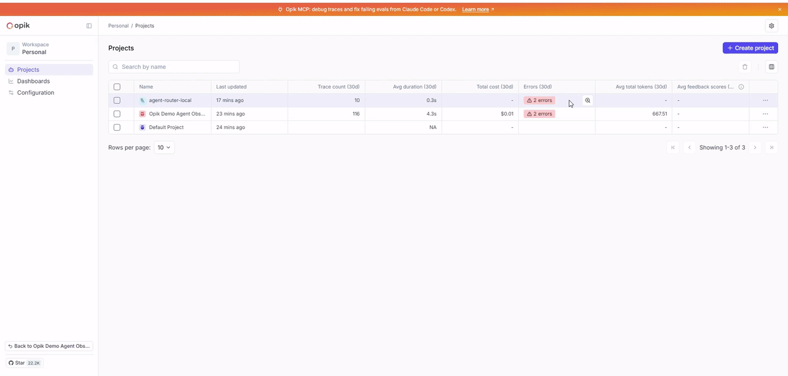
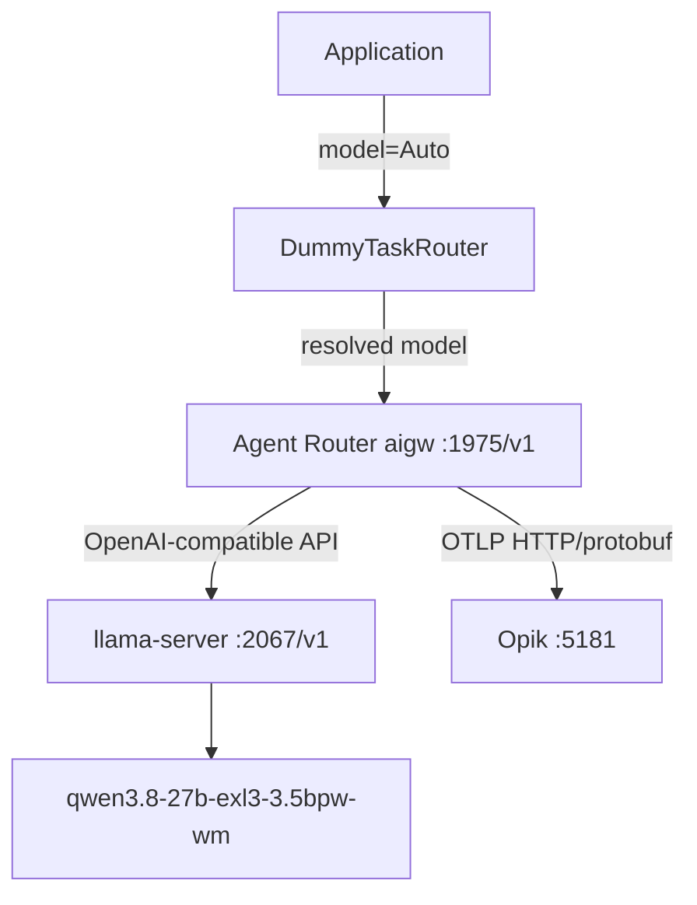

# Agent Router + Opik ローカルLLMゲートウェイ



Applicationからllama-serverを直接呼び出さず、Task RouterとAgent Routerを経由してローカルLLMへ接続する最小構成です。Task Routerは現在 `DummyTaskRouter` ですが、将来ClassifierやLLMベースの実装へ差し替えられるインターフェースに分離しています。

最短手順は [Quick Start](docs/QUICKSTART.md) を参照してください。

## Architecture



責務は次のように分かれます。

- Application: `LLMGatewayClient`を使ってプロンプトを送る。
- Task Router: `Auto`を実モデル名へ解決する。HTTP通信は行わない。
- Agent Router: Provider通信、OpenAI互換API、将来のRetry/Fallback/Rate Limitの境界を担当する。
- Opik: Agent Routerから送られるOpenTelemetry Traceを観測・評価する。

## Requirements

- LinuxまたはmacOS。Agent Router Standalone CLIの対応環境です。WindowsネイティブではなくWSL2を使用してください。
- Python 3.12以上
- `uv`
- Agent Router v1.1.0の`aigw` CLI
- 起動済みのllama-server
- 起動済みのセルフホストOpik

Agent Routerの正式名称は旧Envoy AI Gatewayから変更されていますが、CLI名は`aigw`のままです。現行の公式情報:

- [Agent Router Getting Started](https://theagentrouter.ai/docs/getting-started/)
- [Agent Router release notes](https://theagentrouter.ai/release-notes/)
- [v1.1.0 release](https://github.com/envoyproxy/ai-gateway/releases/tag/v1.1.0)
- [Opik OpenTelemetry integration](https://www.comet.com/docs/opik/integrations/opentelemetry.mdx)

## Installation

依存関係をプロジェクト内のuv環境へインストールします。

```bash
UV_CACHE_DIR="$PWD/.uv-cache" uv venv --python 3.12
UV_CACHE_DIR="$PWD/.uv-cache" uv sync --link-mode=copy
```

`aigw`はAgent Router公式リリースのLinux用バイナリを取得し、PATHへ配置してください。amd64 Linuxの例:

```bash
gh release download v1.1.0 \
  --repo envoyproxy/ai-gateway \
  --pattern 'aigw-linux-amd64' \
  --output "$HOME/.local/bin/aigw"
chmod +x "$HOME/.local/bin/aigw"
aigw version
```

`gh`を使わない場合は、[公式リリースページ](https://github.com/envoyproxy/ai-gateway/releases/tag/v1.1.0)から実行環境に合う`aigw-linux-amd64`または`aigw-linux-arm64`を取得してください。

## Environment variables

`.env.example`を`.env`へコピーして、必要な値だけ変更してください。`.env`はGitへコミットしないでください。

```bash
cp .env.example .env
```

主要な接続先:

- `AGENT_ROUTER_BASE_URL=http://127.0.0.1:1975`: Applicationが見る唯一のLLM Gateway。
- `LLAMA_SERVER_BASE_URL=http://127.0.0.1:2067`: Agent Routerが見るBackend。
- `OPIK_BASE_URL=http://127.0.0.1:5181`: Opik UI/API。`start-agent-router.sh` が OTLP endpoint をこの値から生成する。
- `OPIK_ENABLED`: `true` なら Agent Router が Opik へ Trace を送り、`false` なら `OTEL_TRACES_EXPORTER=none` にする。
- `TASK_ROUTER_DEFAULT_MODEL`: `Auto`の解決先。
- `LLM_API_STYLE`: 初期値は`chat_completions`。`responses`も選択可能。
- `OTEL_AIGW_SPAN_REQUEST_HEADER_ATTRIBUTES`: `X-Session-ID` と `X-Request-ID` を span 属性へ写す Header Mapping。
- `OPENINFERENCE_HIDE_INPUTS` / `OPENINFERENCE_HIDE_OUTPUTS`: Opikへ入力・出力を送るかの設定。

`/v1`は設定値に含めても含めなくても構いません。クライアントと起動スクリプトが二重付加を防ぎます。

本番環境や個人情報を扱う環境では、プロンプトと回答をOpikへ保存してよいか確認し、必要に応じて`OPENINFERENCE_HIDE_INPUTS=true`と`OPENINFERENCE_HIDE_OUTPUTS=true`を設定してください。

## 起動順序

1. llama-server
2. Opik
3. Agent Router
4. Application

llama-serverは既存の`http://127.0.0.1:2067/v1`を使用します。Opik本体は公式リポジトリを使用し、このリポジトリへDocker Compose定義を複製しません。

### llama-server確認

```bash
make check-llama
```

`GET http://127.0.0.1:2067/v1/models`を確認します。

### Opik起動・確認

公式のLocal installationをまだ取得していない場合:

```bash
git clone https://github.com/comet-ml/opik.git "$HOME/opik"
```

`:5173`は既存のWebLLMアプリが使用しているため、Opikは`:5181`で起動します。

```bash
make opik-up
```

`make opik-up`は`$HOME/opik/opik.sh`を`NGINX_PORT=5181`で実行し、OTLP endpointまで確認します。別の配置先を使う場合は`OPIK_REPO_DIR`を設定してください。

### Agent Router起動

```bash
make agent-router-up
```

スクリプトは次の環境変数を設定して`aigw run`を実行します。

```text
OPENAI_BASE_URL=http://127.0.0.1:2067/v1
OPENAI_API_KEY=<LLAMA_SERVER_API_KEY>
OTEL_TRACES_EXPORTER=otlp            # OPIK_ENABLED=false のときは none
OTEL_EXPORTER_OTLP_PROTOCOL=http/protobuf
OTEL_EXPORTER_OTLP_TRACES_ENDPOINT=<OPIK_BASE_URL>/api/v1/private/otel/v1/traces
AI_GATEWAY_TRACING_SEMCONV=openinference
OTEL_AIGW_SPAN_REQUEST_HEADER_ATTRIBUTES=agent-session-id:session.id,x-session-id:session.id,x-request-id:request.id
```

Agent RouterのOpenAI互換入口は`http://127.0.0.1:1975/v1`、Admin endpointは`http://127.0.0.1:1064/health`と`/metrics`です。

## Applicationからの利用

```python
from llm_gateway import LLMGatewayClient


async with LLMGatewayClient.from_env() as client:
    text = await client.complete("Hello", model="Auto")
```

既存コード向けの互換APIも残しています。

```python
from llm_gateway import LlamaServerEnvConfig, call_llama_server


cfg = LlamaServerEnvConfig.from_env()
text = await cfg.complete("Hello")

text = await call_llama_server(openai_client, model, prompt, enable_thinking=False)
```

内部経路は必ず次の順番になります。

```text
Application
  -> DummyTaskRouter
  -> Agent Router :1975/v1
  -> llama-server :2067/v1
```

`LlamaServerEnvConfig`は既存の `cfg.complete("Hello")` APIを維持する互換wrapperです。内部では`LLMGatewayClient`へ委譲します。`call_llama_server`は新シグネチャ `call_llama_server(prompt, *, model="Auto")` に加え、旧シグネチャ `call_llama_server(client, model, prompt, *, enable_thinking=..., timeout_seconds=..., max_retries=..., retry_base_delay_seconds=..., retry_max_delay_seconds=...)` も受け付けます。旧`client`は使わず、必ずAgent Router経由になります。

## Tests

Unit Testは外部サービスなしで実行できます。

```bash
make test
```

起動済みサービスを使うIntegration Testは明示的に実行します。

```bash
make integration
```

Integration Testは次を確認します。

- llama-serverとAgent Routerのhealth
- `Application -> DummyTaskRouter -> Agent Router -> llama-server`
- Chat Completions経路
- Responses APIの Test A（llama-server直接）と Test B（Agent Router経由）
- Autoモデル解決
- thinking/top_k/min_pを含むリクエストのE2E到達と、Opik traceによるパラメータ検証

## Smoke test

```bash
make smoke-test
```

llama-server、Agent Router、Opikの確認後、Application相当のPython CLIから`model=Auto`で`Hello`を送ります。

## Opik traceの確認

1. `http://127.0.0.1:5181`をブラウザで開く。
2. `OPIK_PROJECT_NAME`のプロジェクトを開く。
3. Agent Router経由のLLM呼び出しを開く。
4. model、latency、token usage、input、outputが利用可能な範囲で記録されていることを確認する。

OpikのOTLP endpointはHTTP/protobufです。gRPC endpointや`/v1/traces`ではなく、次を使用します。

```text
http://127.0.0.1:5181/api/v1/private/otel/v1/traces
```

## localhost、127.0.0.1、Docker、WSL2

- ApplicationとAgent Routerを同じWSL環境で動かす場合、`127.0.0.1`は同じWSL環境を指します。
- Windowsブラウザから見る場合も、通常は同じ `http://127.0.0.1:...` で開けます。Agent Router AdminはIPv4専用proxy経由で `http://127.0.0.1:1064/health` を公開します（`make agent-router-up`）。
- Dockerコンテナ内の`127.0.0.1`はホストや別コンテナではありません。コンテナからホスト上のllama-serverへ接続する場合は、Docker環境に応じて`host.docker.internal`などを設定してください。
- WSL2とWindowsネイティブプロセス間では、localhost転送の有無やWindows Firewallにより到達性が変わります。
- Agent Router Standalone CLIはLinux/macOS向けです。Windowsネイティブでの動作保証はしません。

## Troubleshooting

- `aigw was not found`: Agent Router v1.1.0のバイナリを取得し、`PATH`または`AIGW_BIN`へ設定してください。
- `llama-server health check failed`: `curl http://127.0.0.1:2067/v1/models`を実行し、llama-serverの待受を確認してください。
- `Agent Router health check failed`: Agent Router起動ログと`http://127.0.0.1:1064/health`を確認してください。
- `Opik health check failed`: Opikの既存起動方法、ポート5181、WSL/Docker間のアドレスを確認してください。
- `top_k`や`min_p`が拒否される場合: Agent RouterのOpenAI互換変換で失われていないか、llama-serverのログと実際のレスポンスを確認してください。Applicationからllama-serverへの直接接続へ戻さないでください。

## Known limitations

- Task Routerは`Auto`をローカルQwenへ固定するDummy実装です。
- ProviderはAgent Routerの背後にあるlocal backendのみです。
- Kubernetes、Fallback、複数Provider、Quota、Rate Limit、MCP Gatewayは実装していません。
- このリポジトリはOpik本体を起動・再インストールしません。
- OpenTelemetryの最終的な収集成否は、Agent Router v1.1.0と起動済みOpikの実行ログおよびOpik UIで確認してください。

## License

Apache License 2.0. 詳細は [LICENSE](LICENSE) を参照してください。
