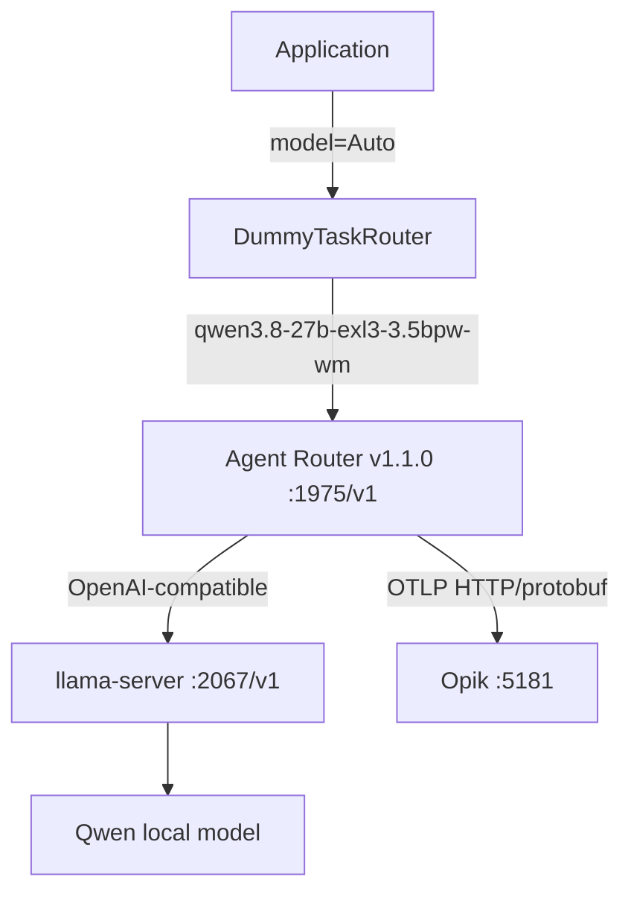

# Agent Router + Opik 実装レポート

## 実装したもの

| ファイル | 役割 |
| --- | --- |
| `src/llm_gateway/config.py` | 環境変数の解析、URL正規化、Thinking生成パラメータ |
| `src/llm_gateway/client.py` | Application向けGateway Client、Chat/Responses、Retry、ログ、エラー変換 |
| `src/llm_gateway/errors.py` | Gateway責務ごとの例外型 |
| `src/llm_gateway/routing/base.py` | Task Router Protocol |
| `src/llm_gateway/routing/models.py` | `RouteDecision` |
| `src/llm_gateway/routing/dummy.py` | `Auto`をlocal Qwenへ解決するDummy実装 |
| `tests/unit/` | 外部サービスなしの設定、Routing、Client、Retryテスト |
| `tests/integration/` | llama-server、Agent Router、Opikを使うE2Eテスト |
| `scripts/start-agent-router.sh` | Agent Router v1.1.0 Standalone起動 |
| `scripts/start-opik.sh` | 公式Opikリポジトリを`:5181`で起動 |
| `scripts/check-*.sh` | llama-server、Agent Router、Opikの検証 |
| `scripts/smoke-test.sh` | ApplicationからのSmoke Test |
| `.env.example` | Gateway、モデル、OTLP、Opik設定の例 |
| `README.md` | Architecture、起動順序、環境差分、Troubleshooting |
| `docs/llm-gateway-architecture.md` | 責務分離と設計判断 |
| `infra/agent-router/README.md` | Agent Router設定 |
| `infra/opik/README.md` | 公式Opikの起動とOTLP設定 |
| `Makefile` | `make test`、`make integration`、`make smoke-test`など |

既存コードが存在しない初期リポジトリだったため、`LlamaServerEnvConfig`は新しい`LLMGatewayEnvConfig`のaliasとして用意し、将来の外部利用に対する互換名を確保しました。

## 最終Architecture

`:5173`は既存のWebLLMアプリが使用していたため、Opikの公式Local installationは`NGINX_PORT=5181`で起動しました。

## 動作確認結果

| 確認項目 | 結果 | 根拠 |
| --- | --- | --- |
| llama-server health | **PASS** | `GET :2067/v1/models` |
| Agent Router health | **PASS** | `GET :1064/health` |
| `chat.completions` | **PASS** | Application経由とcurl経由でQwen応答 |
| `responses` | **FAIL** | 現行Standalone自動設定で`POST :1975/v1/responses`が404 |
| Auto routing | **PASS** | `Auto -> qwen3.8-27b-exl3-3.5bpw-wm` |
| Thinking false | **PASS** | Chat Completions E2E |
| Thinking true | **PASS** | Chat Completions E2E、Opik traceで`enable_thinking=true`を確認 |
| `top_k` | **PASS** | Opik traceのrequest valueに`top_k=20` |
| `min_p` | **PASS** | Opik traceのrequest valueに`min_p=0` |
| `max_tokens` | **PASS** | Opik traceのrequest valueに`max_tokens=1000` |
| OpenTelemetry | **PASS** | Agent Routerから`:5181/api/v1/private/otel/v1/traces`へ送信 |
| Opik trace | **PASS** | `agent-router-local`に9 trace、model/input/output/parametersを確認 |
| Unit tests | **PASS** | 16 passed |
| Integration tests | **PASS** | 6 passed、Responsesの既知404は1 xfailed |

Responses APIの失敗は隠さず、Responses経路自体は削除せず`LLM_API_STYLE=responses`で選択できる状態を維持しています。

## Agent Router経由パラメータ互換性

| パラメータ | Application | Agent Router | llama-server / Opik trace |
| --- | --- | --- | --- |
| `temperature` | `0.7`または明示値 | 維持 | **PASS** |
| `top_p` | `0.8`または明示値 | 維持 | **PASS** |
| `top_k` | `extra_body` | 維持 | **PASS** |
| `min_p` | `extra_body` | 維持 | **PASS** |
| `chat_template_kwargs.enable_thinking` | `extra_body` | 維持 | **PASS** |
| `max_tokens` | Chat Completions | 維持 | **PASS** |

OpenInferenceのOpik traceに、リクエストの`value`としてllama.cpp固有フィールドを含む実データが記録されました。`llm.invocation_parameters`の標準項目と、`value`に記録される追加項目の差はOpikの表示形式によるものです。

## 問題

1. 最初に指定されていた`:5173`はOpikではなく既存のWebLLMアプリでした。そのためOTLP POSTが404になりました。公式Opikを`:5181`で起動し、Agent Routerの送信先を変更して解決しました。
2. Agent Router v1.1.0のOpenAI互換Backend自動設定では、`/v1/responses`がBackend 404になります。初期標準経路のChat Completionsは正常です。Responsesのサポート範囲は、固定設定または別Backendで追加調査が必要です。
3. Opikの`agent-router-local`にはResponses 404のエラーtraceも2件記録されています。これは失敗を観測できている状態であり、成功traceと混同していません。

## 未実装

- 本物のClassifier、LLM、MoEによるTask Router
- OpenAI、Anthropic、Gemini、Bedrock、GroqなどのApplication側Provider実装
- Provider fallback、Cost-aware routing、Difficulty-aware routing
- Kubernetes、複数Agent Router、TLS、OAuth、Production Rate Limit、Quota
- MCP Gateway
- OpikのTraceを使った自動的なRoutingフィードバック

## 次の実装候補

1. 本物のTask Router
2. OpenAI追加
3. Anthropic追加
4. Gemini追加
5. Provider fallback
6. Cost-aware routing
7. Difficulty-aware routing
8. Model performance feedback from Opik
9. MCP Gateway
