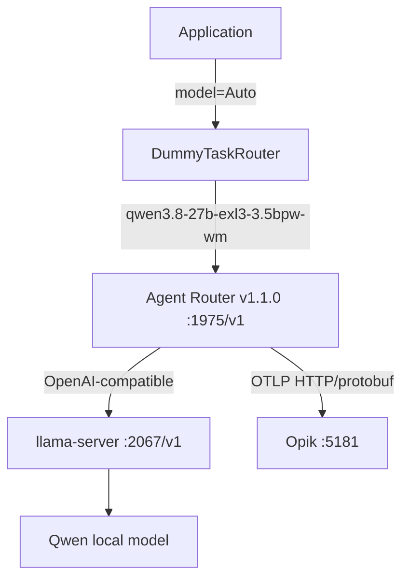

# Agent Router + Opik 実装レポート

## 実装したもの

| ファイル | 役割 |
| --- | --- |
| `src/llm_gateway/config.py` | 環境変数の解析、URL正規化、Thinking生成パラメータ、`LlamaServerEnvConfig`互換wrapper |
| `src/llm_gateway/client.py` | Application向けGateway Client、Chat/Responses、Retry、ログ、エラー変換、`call_llama_server`互換layer |
| `src/llm_gateway/errors.py` | Gateway責務ごとの例外型 |
| `src/llm_gateway/routing/base.py` | Task Router Protocol |
| `src/llm_gateway/routing/models.py` | `RouteDecision` |
| `src/llm_gateway/routing/dummy.py` | `Auto`をlocal Qwenへ解決するDummy実装 |
| `tests/unit/` | 外部サービスなしの設定、Routing、Client、Retry、互換API、OTEL環境変数テスト |
| `tests/integration/` | llama-server、Agent Router、Opikを使うE2Eテスト |
| `scripts/lib/opik-otel-env.sh` | `OPIK_ENABLED` / `OPIK_BASE_URL` からOTEL設定を生成 |
| `scripts/start-agent-router.sh` | Agent Router v1.1.0 Standalone起動、Header Mapping、Opik連動 |
| `scripts/start-opik.sh` | 公式Opikリポジトリを`:5181`で起動 |
| `scripts/check-*.sh` | llama-server、Agent Router、Opikの検証 |
| `scripts/smoke-test.sh` | ApplicationからのSmoke Test |
| `.env.example` | Gateway、モデル、Opik設定の例 |
| `README.md` | Architecture、起動順序、環境差分、Troubleshooting |
| `docs/llm-gateway-architecture.md` | 責務分離と設計判断 |
| `infra/agent-router/README.md` | Agent Router設定 |
| `infra/opik/README.md` | 公式Opikの起動とOTLP設定 |
| `Makefile` | `make test`、`make integration`、`make smoke-test`など |

`LlamaServerEnvConfig`は単純aliasではなく、`complete()`を持つ互換wrapperです。`call_llama_server`は新APIと旧シグネチャの両方を受け付け、旧`client`は使わずAgent Routerへ委譲します。

## 最終Architecture



`:5173`は既存のWebLLMアプリが使用していたため、Opikの公式Local installationは`NGINX_PORT=5181`で起動しました。

## 動作確認結果

| 確認項目 | 結果 | 根拠 |
| --- | --- | --- |
| llama-server health | **PASS** | `GET :2067/v1/models` |
| Agent Router health | **PASS** | `GET :1064/health` |
| `chat.completions` | **PASS** | Application経由とcurl経由でQwen応答 |
| Responses Test A（llama-server直接 `:2067/v1/responses`） | **FAIL (404)** | `POST :2067/v1/responses` → 本文 `404: Not Found`、`Server: Python/3.12 aiohttp/3.14.3` |
| Responses Test B（Agent Router `:1975/v1/responses`） | **FAIL (404)** | `POST :1975/v1/responses` → `OpenAIBackendError` で backend の `404: Not Found` を転送 |
| Auto routing | **PASS** | `Auto -> qwen3.8-27b-exl3-3.5bpw-wm` |
| Thinking false | **PASS** | Chat Completions E2E |
| Thinking true | **PASS** | Chat Completions E2E、Opik traceで`enable_thinking=true`を確認 |
| `top_k` | **PASS** | Opik APIからtraceを取得して`top_k=20`を検証 |
| `min_p` | **PASS** | Opik APIからtraceを取得して`min_p=0`を検証 |
| `max_tokens` | **PASS** | Opik traceのrequest valueに`max_tokens=1000` |
| OpenTelemetry | **PASS** | Agent Routerから`:5181/api/v1/private/otel/v1/traces`へ送信 |
| Opik trace | **PASS** | `agent-router-local`にtrace、model/input/output/parametersを確認 |
| Unit tests | **PASS** | 互換APIとOTEL環境変数テストを含む |
| Integration tests | Responses A/Bは実測済み | A=FAIL / B=FAIL。chat.completionsは両経路PASS |

Responses APIの失敗は隠していません。Agent Router 1.1の公式仕様では `POST /v1/responses` はFully Supportedであり、OpenAI互換Providerも対応対象です。したがって「Agent RouterはResponses API非対応」とは判断しません。

実測した切り分け:

| Test | 経路 | 結果 |
| --- | --- | --- |
| A | Application → llama-server `:2067/v1/responses` | **FAIL 404** |
| B | Application → Agent Router `:1975/v1/responses` → llama-server | **FAIL 404** |
| 対照 | 両経路の `POST /v1/chat/completions` | **PASS** |

解釈:

- Test A PASS / Test B FAIL → Agent RouterのStandalone自動設定経路に問題がある
- Test A FAIL / Test B FAIL → **今回の実測**。404の起点はllama-server側。このサーバーはllama.cppではなく Python aiohttp + exl3 で、`/v1/chat/completions` と `/v1/models` はあるが `/v1/responses` も `/v1/completions` も無い。Test Bの `OpenAIBackendError` は Agent Router が backend 404 を転送した形であり、Agent Routerがルート未実装で落としている証拠にはならない

## Agent Router経由パラメータ互換性

| パラメータ | Application | Agent Router | llama-server / Opik trace |
| --- | --- | --- | --- |
| `temperature` | `0.7`または明示値 | 維持 | **PASS** |
| `top_p` | `0.8`または明示値 | 維持 | **PASS** |
| `top_k` | `extra_body` | 維持 | **PASS** |
| `min_p` | `extra_body` | 維持 | **PASS** |
| `chat_template_kwargs.enable_thinking` | `extra_body` | 維持 | **PASS** |
| `max_tokens` | Chat Completions | 維持 | **PASS** |

OpenInferenceのOpik traceに、リクエストの`value`としてllama.cpp固有フィールドを含む実データが記録されました。`llm.invocation_parameters`の標準項目と、`value`に記録される追加項目の差はOpikの表示形式によるものです。E2EテストはOpik APIからtraceを取得し、model / top_k / min_p / enable_thinking を自動検証します。

## session相関

Applicationは次のヘッダーを送ります。

```text
X-Request-ID
X-Session-ID
agent-session-id
```

Agent Router側では Header Mapping を明示します。metricsには載せず、spanとaccess logに限定します。

```text
OTEL_AIGW_SPAN_REQUEST_HEADER_ATTRIBUTES=agent-session-id:session.id,x-session-id:session.id,x-request-id:request.id
```

既定の `agent-session-id → session.id` だけに頼らず、Applicationが使う `X-Session-ID` も `session.id` へ写します。

## 問題

1. 最初に指定されていた`:5173`はOpikではなく既存のWebLLMアプリでした。そのためOTLP POSTが404になりました。公式Opikを`:5181`で起動し、Agent Routerの送信先を変更して解決しました。
2. `:2067` のllama-server（Python aiohttp + exl3）は `POST /v1/responses` を実装していません。Test AもTest Bも404です。Agent Routerはbackend 404を `OpenAIBackendError` として転送しており、「Agent Router 1.1がResponses非対応」や「Standalone自動設定経路だけが壊れている」とは判断しません。今回の初期経路はこれまでどおり Chat Completions で問題ありません。Responses を通したいなら、`:2067` 側が `/v1/responses` を実装する必要があります。
3. Opikの`agent-router-local`にはResponses 404のエラーtraceも記録され得ます。これは失敗を観測できている状態であり、成功traceと混同していません。

## 未実装

- 本物のClassifier、LLM、MoE、JevによるTask Router
- OpenAI、Anthropic、Gemini、Bedrock、GroqなどのApplication側Provider実装
- Provider fallback、Cost-aware routing、Difficulty-aware routing
- Kubernetes、複数Agent Router、TLS、OAuth、Production Rate Limit、Quota
- MCP Gateway
- OpikのTraceを使った自動的なRoutingフィードバック

## 次の実装候補

1. 本物のTask Router（Classifier / LLM / Jev 等）
2. OpenAI追加
3. Anthropic追加
4. Gemini追加
5. Provider fallback
6. Cost-aware routing
7. Difficulty-aware routing
8. Model performance feedback from Opik
9. MCP Gateway
